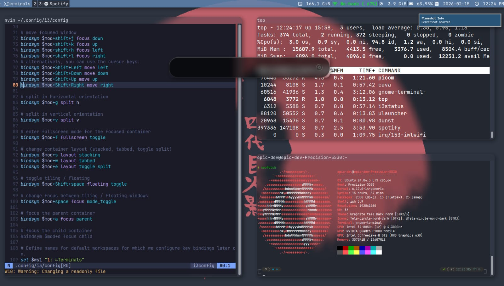
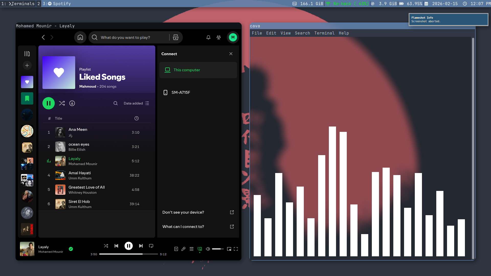

# My Dotfiles

## Preview
<p align="center">



</p>

## The Stack
* **OS:** Ubuntu 24.04
* **Window Manager:** [i3wm](https://i3wm.org/)
* **Status Bar:** i3status
* **Shell:** zsh with [ Oh My Zsh!!]
* **Terminal:** [GNOME Terminal]
* **Editor:** [Neovim-kikstart_project](https://github.com/
nvim-lua/kickstart.nvim)
* **App Launcher** ULuancher 
    - note that this is an educational project not a distro I'm using it to learn nvim config and lua


How to use
I use these on Ubuntu. Backup your existing configs before copying!
```bash
# Example for i3
cp -r i3 ~/.config/

# Example for nvim
cp -r nvim ~/.config/


## Credits
### I used this article by sager sharma [link](https://itsfoss.com/i3-customization/)
 to build most of the i3/i3status 


